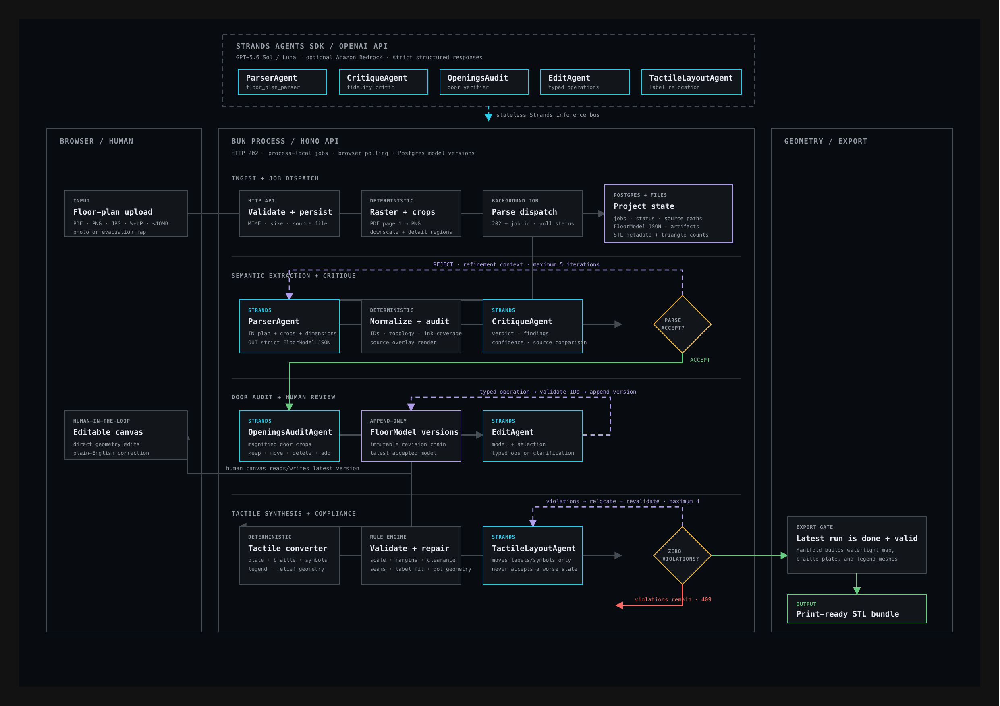

<p align="center">
  
</p>

<h1 align="center">Trace</h1>

<p align="center">
  <strong>Floor plan in. Tactile map out.</strong><br />
  Trace helps building owners turn one floor plan into an editable tactile-map
  design and print-ready STL files for blind and low-vision visitors.
</p>

<!-- README-HACK:NEEDS-OWNER key="live-demo" instruction="Replace with the final public Trace-branded deployment URL." -->
<!-- README-HACK:NEEDS-OWNER key="demo-video" instruction="Replace with the final public demo video URL." -->

## The idea

A sighted visitor can glance at a lobby map and understand a building before
walking through it. A blind visitor is often left with verbal directions and no
equivalent spatial overview.

Tactile maps solve that problem, but each one normally requires specialist
interpretation, simplification, braille layout, and fabrication. Trace assists
that design process: it converts an existing plan into structured geometry,
keeps a human in control of uncertain details, and prepares files for physical
review and 3D printing.

## What Trace does

1. **Upload** a PDF, PNG, JPG, or WebP plan up to 10 MB.
2. **Interpret and challenge** it with specialized source-reading, parsing,
   critique, refinement, and openings-audit roles.
3. **Review and edit** the typed floor model on a canvas or through constrained
   natural-language operations.
4. **Convert and measure** it with deterministic tactile geometry, braille,
   spacing, clearance, seam, and label-fit checks.
5. **Export** map tiles and braille-legend STL files only when the current
   tactile design has zero reported violations.

The opening image is the product flow: source plan on the left, tactile design
on the right, with the intended reader remaining the reason for every step.

## AI proposes. Geometry disposes.

Trace is not a one-shot image-to-STL prompt. Agents produce typed proposals;
application code validates their schemas, limits what they can change, versions
accepted edits, and independently decides whether export is allowed.

- Source and rendered-model views are compared in a bounded critique/refinement
  loop, with a separate magnified audit for doors and passages.
- Every model invocation is a fresh Strands agent. The current OpenAI route uses
  GPT-5.6 Sol for visual/spatial work and GPT-5.6 Luna for constrained edits.
- Mechanical repair runs first during tactile layout. The layout agent may only
  move labels or symbols named by current violations, and code revalidates every
  proposal.

## Architecture

[](output/pdf/trace-architecture.pdf)

The Next.js wizard talks to a Bun and Hono API. PostgreSQL stores project state,
append-only floor-model versions, tactile runs, and export records; source plans
and generated artifacts use the service filesystem. Parsing and tactile jobs
run in-process, while deterministic mechanical repair runs in a worker thread.

Strands provides isolated multimodal turns, structured output, retries,
cancellation, and usage reporting. OpenAI Responses is the configured local
provider; Amazon Bedrock remains an explicit optional route with no silent
fallback between providers.

## Built with

- Next.js 16, React 19, Tailwind CSS, and Three.js
- Bun, Hono, PostgreSQL, and Drizzle ORM
- Strands Agents SDK with the OpenAI Responses API
- Zod schemas and a shared typed floor-model package
- Manifold 3D for watertight binary STL generation

## Run locally

Prerequisites: Bun 1.3+, PostgreSQL 17, and an OpenAI API key.

```bash
bun install --frozen-lockfile
cp apps/api/.env.example apps/api/.env
cp apps/web/.env.example apps/web/.env.local
cd apps/api && bun run db:migrate && cd ../..
bun run dev
```

Open <http://localhost:3000>. The API runs on <http://localhost:3003>.

```bash
bun run typecheck
bun run lint
bun test packages/floor-model apps/api/src apps/web/src
bun run build
```

## License

Trace is available under the [MIT License](LICENSE).
