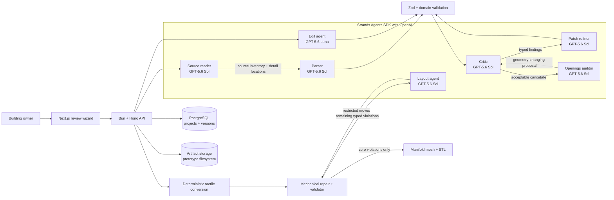

<p align="center">
  
</p>

<h1 align="center">Trace</h1>

<p align="center">
  <strong>Floor plan in. Tactile map out.</strong><br />
  Strands agents turn an existing building plan into editable tactile geometry and STL files for review and printing.
</p>

## Why Trace

A sighted visitor can glance at a lobby map before entering an unfamiliar building. A blind visitor often has to ask for directions or memorize a verbal description. Tactile maps provide the missing mental model, but specialist production is slow and expensive.

Trace helps automate the design bottleneck. A building owner uploads a plan, reviews what the system understood, and downloads STL files for the map and its braille legend.

## End-to-end workflow

1. **Upload** a PDF, PNG, JPG, or WebP plan up to 10 MB.
2. **Read and extract** source names, facility meanings and open connections, then trace walls, rooms, openings, routes, and landmarks as typed vector data.
3. **Verify** the extraction through a bounded visual critique/refinement loop, matched quadrant review (four parallel initial critics on large plans), source-grounded small-connection hints, and a separate magnified opening audit. Geometry-changing audit proposals return to source review before acceptance.
4. **Review** low-confidence elements on an editable canvas or request a constrained natural-language edit.
5. **Convert** the floor model into tactile geometry with implemented measurements informed by BANA 2022 and ADA §703.
6. **Repair and verify** layout conflicts through a bounded agent/validator loop.
7. **Export** only after the validator reaches zero reported violations.

These checks do not establish exhaustive standards compliance or certification. Source accuracy, slicer inspection, physical prints, and accessibility review with intended users remain required. Printing cost depends on map and legend plate count, printer, and material.

## Architecture



The model is deliberately not the compliance authority: **AI proposes; geometry disposes.** Strands owns the specialized agent loops, multimodal messages, structured-output tool calls, retry behavior, cancellation, and usage metrics. Application code owns bounded orchestration, state transitions, strict schemas, physical measurements, and the export gate.

Fresh Strands agents are created for every invocation. Explicit, project-scoped handoffs retain the source inventory, detail crops, current model and previous review claims without sharing conversation history or images between projects. Refinement patches preserve untouched elements.

## Why Strands is substantive here

- Specialized structured roles for source reading, extraction, patch refinement, critique, openings audit, edits, and tactile layout.
- Native multimodal `ContentBlock` inputs preserve the exact interleaving of full-plan images, crops, overlays, and model data.
- Native structured-output tool calls validate every role-specific Zod wire schema and can repair invalid tool arguments within a bounded agent turn budget.
- The local OpenAI route uses GPT-5.6 Sol for visual/spatial work and GPT-5.6 Luna for constrained edits. The explicit Bedrock route remains available; there is no silent provider fallback.
- Per-call cancellation, built-in retries, token counts, and latency metrics are surfaced by the shared Strands adapter.
- TypeScript retains deterministic control of the two self-correcting loops and enforces the implemented export checks; passing them is not proof of physical safety or accessibility.

## Run locally

### Prerequisites

- Bun 1.3 or newer
- PostgreSQL 17
- An OpenAI API key with inference access and available API spending allowance

On macOS, use Colima for a local PostgreSQL 17 container. Start Colima with
`colima status || colima start`, then provide the database connection through
`DATABASE_URL`.

Install and configure:

```bash
bun install --frozen-lockfile
cp apps/api/.env.example apps/api/.env
cp apps/web/.env.example apps/web/.env.local
```

Set `DATABASE_URL` and `OPENAI_API_KEY` in `apps/api/.env`. Keep the key local
and untracked. The example selects `MODEL_PROVIDER=openai`; Amazon Bedrock is
available only when selected explicitly and configured with AWS credentials.
Google OAuth is optional for local use.

Migrate and start both services:

```bash
cd apps/api
bun run db:migrate
cd ../..
bun run dev
```

- Web: `http://localhost:3000`
- API: `http://localhost:3003`
- Health/model configuration: `curl http://localhost:3003/`

### Try the workflow

1. Upload `test-assets/floor-plans/house-bolduc.png`.
2. Watch the parser and critic iterate; inspect every low-confidence element.
3. Make a direct edit or try `rename the lobby Reception`.
4. Continue to tactile conversion and inspect the validator history.
5. Download the map and legend STL files after the design reaches zero violations.

Critical multimodal runs can take several minutes because a difficult plan may require multiple visual reviews.

The OpenAI route uses Strands' native Responses provider, medium reasoning,
stateless requests (`store: false`), and one structured-output call at a time.
Authentication or exhausted spending limits fail visibly rather than triggering
a provider fallback.

## Verification

```bash
bun run typecheck
bun run lint
bun test packages/floor-model apps/api/src apps/web/src
bun run build
```

For the live corpus, start the configured API and run:

```bash
bun run eval:live
```

The deterministic suite covers schemas, structured-output wire compatibility,
multimodal serialization, concurrent invocation isolation, bounded retries and
cancellation, constrained edits, doorway auditing, tactile conversion, braille
geometry, validator rules, mechanical repair, and rendering. The live corpus
runner records stage and model provenance, artifacts, scores, and failures.

## Current development priorities

The current phase is local product quality: complete workflows, agent behavior, deterministic safety checks, evaluation evidence, and output usefulness.

## Prototype boundaries

- One floor per map; clean top-down plans work best.
- English, Grade 1 UEB braille, and a fixed tactile symbol vocabulary.
- Uploaded images and STLs currently use the service filesystem.
- Background jobs are in-process and are marked failed after a server restart.
- Repeated live corpus comparisons, slicer verification, physical prints, and blind-reader evaluation remain required before production use.

## License

Trace's original code is licensed under the [MIT License](LICENSE).

Plain-language summary: you can use, modify, and distribute the code—including commercially—without asking permission. Keep the copyright and license notices in copies or substantial portions of the code. The software is provided without warranty; the full license controls.

Third-party dependencies and assets remain subject to their own licenses.
